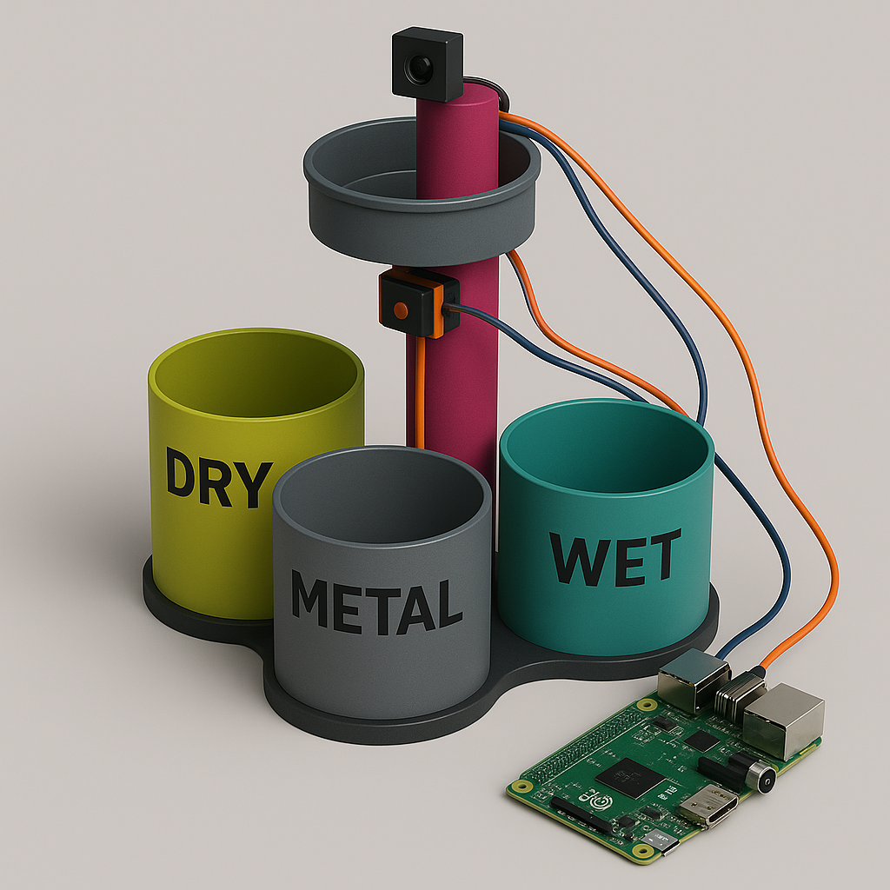

# ♻️ Embedded Waste Separator
An intelligent, real-time trash classification system developed using **Raspberry Pi 3 Model B+**, designed to sort waste into **dry**, **wet**, and **metal** categories using multiple sensors and motors.

> 🚀 Developed as a final project for **INF208 – Eingebettete Systeme** (Embedded Systems).

## 📷 System Overview

<p align="center">
  
</p>

## 🌍 Why This Project Matters
In today's world, waste separation is essential for environmental sustainability. However, manual sorting is time-consuming, error-prone, and labor-intensive.  
**Embedded Waste Separator** offers a fully automated, low-cost and scalable solution for smart cities, schools, and industrial recycling setups.

This is more than just a student project — it's a model for the **future of eco-conscious automation**. 🌱🌐

## 🧩 Key Features
- 🚦 Real-time object detection  
- 🧲 Metal recognition via proximity sensor (powered externally at 12V)  
- 💧 Moisture classification via rain sensor  
- 🔁 Stepper motor rotation to appropriate bin (dry/wet/metal) using shortest angle path  
- 🤖 Servo-controlled trash lid  
- 🧠 System remembers last position to avoid unnecessary movements  
- 🛠️ Fully written in Python using `RPi.GPIO` and `RpiMotorLib`

## 🔧 Hardware Used
- Raspberry Pi 3 Model B+  
- IR Sensor (Object Detection)  
- Rain/Moisture Sensor  
- Metal Proximity Sensor (Powered via 12V LED Driver)  
- 28BYJ-48 Stepper Motor + ULN2003 Driver  
- Servo Motor (Lid Mechanism)  
- Buzzer  
- Breadboard, jumper wires, resistors  

## ⚙️ Installation & Usage
### 🔽 Step 1 – Clone the Repository
```bash
git clone https://github.com/cetinss/embedded_waste_separator.git
cd embedded-waste-separator
```
### 🛠️ Step 2 – Install Dependencies
```bash
pip3 install -r requirements.txt
```
### ▶️ Step 3 – Run the System
```bash
sudo python3 waste_separator.py
```
> ⚡ Make sure all sensors are correctly wired and the metal sensor is connected to an external 12V source.

## 📂 Project Structure
```
embedded-waste-separator/
├── waste_separator.py         # Main Python script
├── requirements.txt           # Python dependencies
├── README.md                  # Project documentation
├── LICENSE                    # MIT License
└── images/
    └── system_setup.png       # AI-generated visual of final system
```

## 💡 Real-World Applications
- ♻️ Smart city waste bins that classify and compact trash on-site  
- 🏫 Educational robotics kits for learning about sustainability & embedded systems  
- 🏢 Office or public-area sorting modules  
- 🏭 Scalable prototypes for industrial waste stream automation


👩‍💻 Project by **Sena Çetin** , **Suden Ocak** , **Hatice Kübra Alaca** , **Elif Beyza Ötoprak** , **Efe Şarlıoğlu**
📚 INF208 – Eingebettete Systeme (Turkish-German University, 2025)

> “Waste that is sorted is waste that is valuable.”
